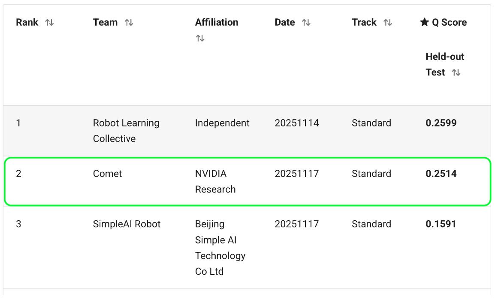

<p align="center">
  
</p>

<p align="left">
  <a href="https://behavior.stanford.edu/index.html">
    
  </a>
  <a href="https://behavior.stanford.edu/challenge/leaderboard.html#privileged-information-track">
    
  </a>
  <a href="https://huggingface.co/sunshk/comet_submission">
    
  </a>
  <a href="docs/report.pdf">
    
  </a>
</p>

# Openpi Comet

> [!TIP]
> OpenPi Comet is the submission of Team Comet for the [2025 BEHAVIOR Challenge](https://behavior.stanford.edu/index.html). This repository provides a unified framework for pre-training, post-training, data generation and evaluation of π0.5 (Pi05) models on BEHAVIOR-1K.

Our [[submission]](https://behavior.stanford.edu/challenge/leaderboard.html#privileged-information-track) achieved a Q-score of 0.2514, securing 2nd place overall and finishing just behind the winning team by a narrow margin—highlighting both the strong competitiveness of our approach and the effectiveness of our end-to-end VLA training strategy. 

<p align="center">
  
</p>


This codebase contains:
1. Distributed OpenPi training infrastructure
2. Various pre-training setup, including hierarchical instructions (global, subtask, skill) and multimodal observations (RGB, depth, point cloud, segmentation, bounding boxes, human pointing)
3. Post-training via Rejection Sampling Fine-Tuning (RFT) with automated dataset construction
4. Data generation scripts such as teleoperation and simulation rollouts using existing policy
5. Model zoo of pretrained VLA checkpoints trained on 1M+ robot interactions

Please check our [[Report]](./docs/report.pdf) for more details.

<div align="center">
  <video src="https://github.com/user-attachments/assets/dc74ce89-a3ba-4a5a-81b7-63557e586f09" controls width="720">
  </video>
</div>


## Updates

- [Dec 6, 2025] Released the full submission codebase and pre-trained weights.
- [TODO] Upload our RFT dataset.


## Requirements

To run the models in this repository, you will need an NVIDIA GPU with at least the following specifications. These estimations assume a single GPU, but you can also use multiple GPUs with model parallelism to reduce per-GPU memory requirements by configuring `fsdp_devices` in the training config. Please also note that the current training script does not yet support multi-node training.

| Mode               | Memory Required | Example GPU        |
| ------------------ | --------------- | ------------------ |
| Inference          | > 8 GB          | RTX 4090           |
| Fine-Tuning (LoRA) | > 22.5 GB       | RTX 4090           |
| Fine-Tuning (Full) | > 70 GB         | A100 (80GB) / H100 |

The repo has been tested with Ubuntu 22.04, we do not currently support other operating systems.

## Repo Clone

```bash
git clone https://github.com/mli0603/comet-2025-b1k-challenge.git
git clone https://github.com/StanfordVL/BEHAVIOR-1K.git
```
This finetuning instruction is adapted from the original [openpi repo](https://github.com/Physical-Intelligence/openpi).

## Installation

Openpi use [uv](https://docs.astral.sh/uv/) to manage Python dependencies. See the [uv installation instructions](https://docs.astral.sh/uv/getting-started/installation/) to set it up. Once uv is installed, run the following to set up the environment:

```bash
cd baselines/openpi
GIT_LFS_SKIP_SMUDGE=1 uv sync
GIT_LFS_SKIP_SMUDGE=1 uv pip install -e .

source .venv/bin/activate

# Install behavior for server deploy 
cd $PATH_TO_BEHAVIOR_1K
uv pip install -e bddl
uv pip install -e OmniGibson[eval]
```

## Model Zoo 🤗

We provide a suite of base VLA model checkpoints trained on 1M+ robot trajectories, ideal for BEHAVIOR-1K fine-tuning.

|   Model Name | Discription                          | HuggingFace URL                                                                                                                                                                                                                                          |
|----------:|:----------------------------------------|:---------------------------------------------------------------------------------------------------------------------------------------------------------------------------------------------------------------------------------------------------------|
| pi05-b1kpt12-cs32 | Pretrained Model in tasks `0,1,6,17,18,22,30,32,34,35,40,45` with action chunk size 32                         | [openpi_comet/pi05-b1kpt12-cs32](https://huggingface.co/sunshk/openpi_comet/tree/main/pi05-b1kpt12-cs32)                                                                  |
| pi05-b1kpt50-cs32 | Pretrained Model in tasks `0-49` with action chunk size 32                                                     | [openpi_comet/pi05-b1kpt50-cs32](https://huggingface.co/sunshk/openpi_comet/tree/main/pi05-b1kpt50-cs32)                                                                  |

<details>
<summary>Full Model Zoo (Per Task)</summary>

TODO: Add the full model zoo (per task) here.

</details>

### Finetune OpenPi

Each time we launch the training, we need to compute the normalization statistics for the training data in advance: 

```bash
uv run scripts/compute_norm_stats.py --config-name pi05_b1k-turning_on_radio
```

This will create `norm_stats.json` under `assets/pi0_b1k/behavior-1k/2025-challenge-demos`, which will be used to normalize the training data.

After this, update the configs in `src/openpi/training/config.py` to be the task name you want (or None to include all tasks), for example, you can update the configs as follows for the `turning_on_radio` task:

```python
TrainConfig(
    name="pi05_b1k-turning_on_radio",
    exp_name="openpi",
    project_name="B1K",
    model=pi0_config.Pi0Config(pi05=True, action_horizon=32),
    data=LeRobotB1KDataConfig(
        repo_id="behavior-1k/2025-challenge-demos",
        base_config=DataConfig(
            prompt_from_task=True,
            episodes_index=list(range(200)),
            behavior_dataset_root="../DATASETS/behavior/2025-challenge-demos",
            tasks=["turning_on_radio"],
            fine_grained_level=0,  # 0: global instruction, 1: subtask instruction, 2: skill instruction
            train_task_type="regular",  # regular | cumulate | mixture
        ),
    ),
    weight_loader=weight_loaders.CheckpointWeightLoader(
        "The Model Path you want to finetune from, e.g., gs://openpi-assets/checkpoints/pi05_base/params\
        or the checkpoint from our model zoo"
    ),
    num_train_steps=30_000,
    lr_schedule=_optimizer.CosineDecaySchedule(
        peak_lr=2.5e-5,
        decay_steps=30_000,
    ),
    freeze_filter=pi0_config.Pi0Config(pi05=True, action_horizon=32).get_freeze_filter(),
    ema_decay=None,
    checkpoint_base_dir=".",
    num_workers=8,
    batch_size=8 * 32,
),
```

Then run the following command to fintune OpenPi:
```bash
XLA_PYTHON_CLIENT_MEM_FRACTION=0.9 uv run scripts/train_val.py pi05_b1k-turning_on_radio \
    --exp_name="openpi_$(date +%Y%m%d_%H%M%S)" \
    --overwrite \
    --batch_size=64 \
    --num_train_steps=50000 \
    --weight_loader.params_path="The Model Path you want to finetune from, e.g., gs://openpi-assets/checkpoints/pi05_base/params \
    or the checkpoint from our model zoo" # also be configurable in the config
```

### Pre-train OpenPi

To support distributed training, we update `src/openpi/training/data_loader.py` for data sharding, and the `src/openpi/training/checkpoints_dist.py` and `scripts/train_dist.py` for distributed checkpointing management and training. To launch the pretrain, run the following command:

```bash
# set dist training envs
export MASTER_ADDR=${SERVICE_PREFIX}-0.${SUBDOMAIN}
export WORLD_SIZE=${LEPTON_JOB_TOTAL_WORKERS}
export WORLD_RANK=${LEPTON_JOB_WORKER_INDEX}
export CUDA_VISIBLE_DEVICES=0,1,2,3,4,5,6,7
export MASTER_PORT=12350

config_name=pi05_b1k-pt50_cs32_bs64_lr2.5e-5_step50k_gpu40
exp_name=pi05_b1k-pt50_pretrain

python scripts/compute_norm_stats.py --config-name ${config_name}

python scripts/train_dist.py ${config_name} --exp_name=${exp_name} --overwrite
```

### Post-train OpenPi using Rejection Sampling fine-tuning (RFT)

To perform RFT, you need to first deploy the finetuned checkpoint, and then rollout the episodes in the BEHAVIOR-1K Simulator. We also observe that the `pose perturbator` helps improve the robustness of the RFT Algorithm. 

1. Copy the `openpi_comet/data_generation/rollout/learning` to `BEHAVIOR-1K/OmniGibson/omnigibson/learning`.
```bash
cp -r data_generation/rollout/learning/* BEHAVIOR-1K/OmniGibson/omnigibson/learning/
```
NOTE: be careful to the latest commit of the BEHAVIOR-1K repo.

2. Run the RFT rollout in parallel:

```bash
python OmniGibson/omnigibson/learning/eval.py policy=websocket \
    save_rollout=true \
    perturb_pose=true \
    eval_on_train_instances=false \
    task.name=turning_on_radio \
    log_path=./outputs/rft \
    use_parallel_evaluator=false \
    parallel_evaluator_start_idx=0 \
    parallel_evaluator_end_idx=10 \
    model.port=8000 \
    env_wrapper._target_=omnigibson.learning.wrappers.RolloutRGBWrapper
```
where `parallel_evaluator_start_idx` and `parallel_evaluator_end_idx` are the start and end index of the parallel rollout, we can distribute the rollout to multiple GPUs by splitting the total number of instances into multiple parts.

3. Build the RFT dataset:
After the rollout, you can build the RFT dataset by running the following command:

```bash
python data_generation/rollout/create_rft_dataset.py \
    --rollout_dir $PATH_TO_ROLLOUT_DATASET \
    --rft_dir $PATH_TO_RFT_DATASET
```

Then, we can perform RFT training on the RFT dataset. Please refer to the [RFT training config](src/openpi/training/config.py) for more details.

### Evaluation

After finetuning, you can run evaluation by following the steps below:

1. Deploy finetuned checkpoint:

    ```
    source .venv/bin/activate
    uv run scripts/serve_b1k.py --task_name=$TASK_NAME policy:checkpoint --policy.config=pi0_b1k --policy.dir=$PATH_TO_CKPT
    ```
    This opens a connection listening on 0.0.0.0:8000. Please check the `scripts/serve_b1k.py` for more details.


2. Run the evaluation on BEHAVIOR:

    Assume you have behavior env installed (check https://github.com/StanfordVL/BEHAVIOR-1K for more details), run the following command within the BEHAVIOR-1K directory:
    ```
    conda activate behavior 
    python OmniGibson/omnigibson/learning/eval.py policy=websocket task.name=turning_on_radio log_path=$LOG_PATH
    ```


## FAQs

If you encounter any issues, feel free to open an issue on GitHub or reach out through discussions. We appreciate your feedback and contributions!

## Citation

If you find this work useful, please consider citing:

```bibtex
@article{comet2025behavior1k,
  title={Comet Submission for BEHAVIOR-1K Challenge},
  author={Comet Team},
  url={https://github.com/mli0603/comet-2025-b1k-challenge},
  year={2025}
}
```

<!-- ```bibtex
@article{comet2025behavior1k,
  title={Comet Submission for BEHAVIOR-1K Challenge},
  author={Comet Team},
  journal={arXiv preprint arXiv:2512.06000},
  url={https://github.com/mli0603/comet-2025-b1k-challenge},
  year={2025}
}
``` -->
